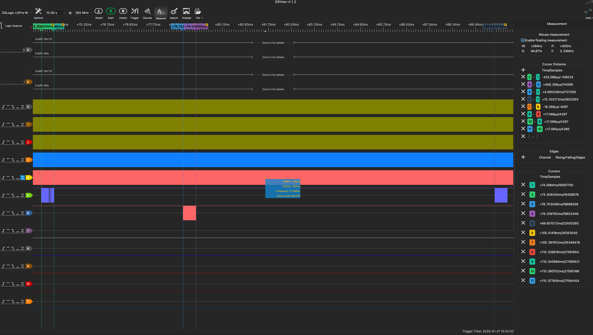
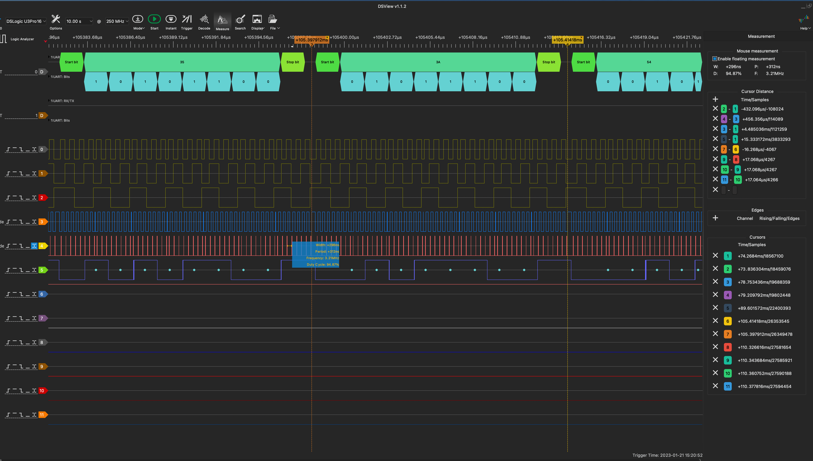
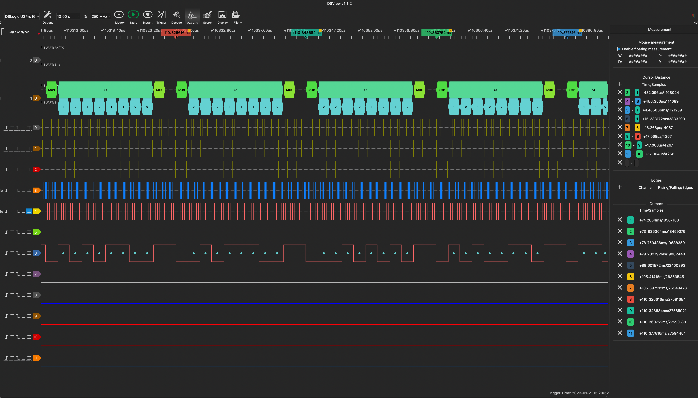
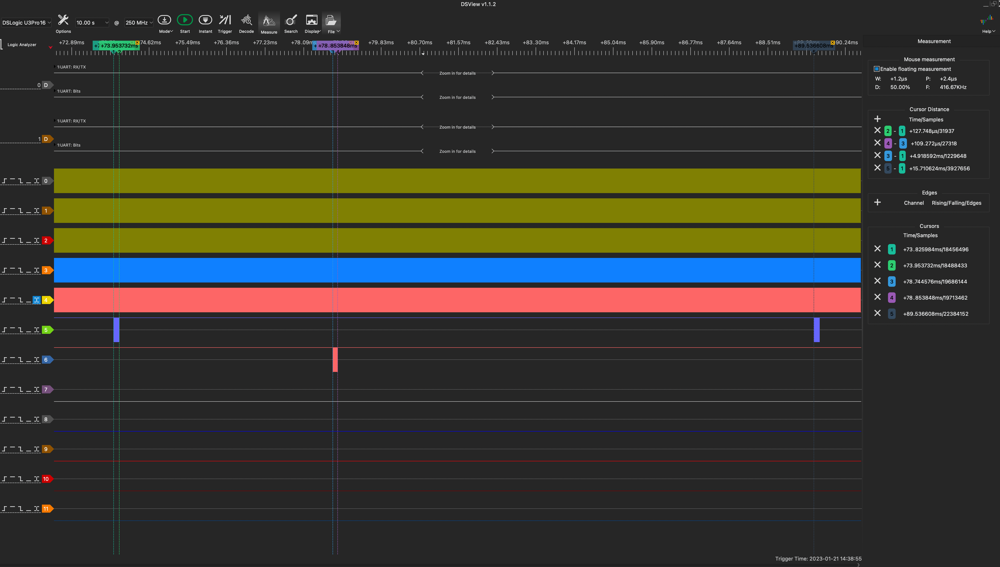
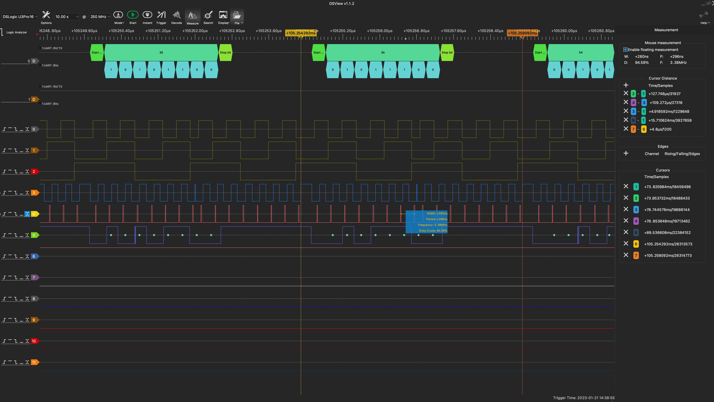
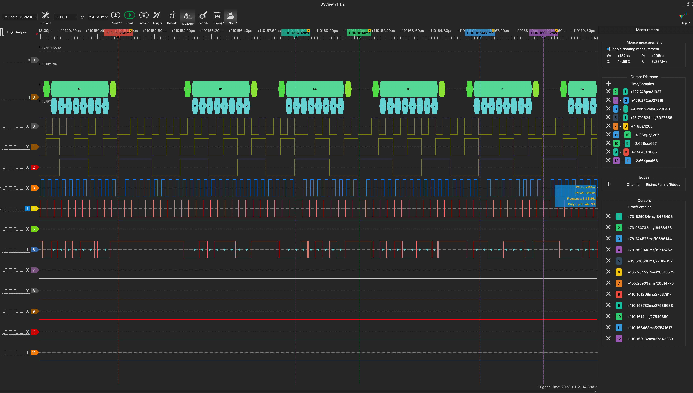

# P2 Octoport Serial Verification
A Parallax Propeller v2 Object for maintaining 2-8 simultaneous serial ports using one COG  - A performance study

![Project Maintenance][maintenance-shield]

[![License][license-shield]](LICENSE)

## 8 Serial Ports using a single COG

A single COG services from 1 to 8 Tx/Rx pairs of pins.  The pins are configured as smart-pins which means that the driver feeds bytes to transmit pins when needed and get bytes from receive pins when bytes are available. This backend driver is written in pasm2. The interface routines are written in spin2.

## Table of Contents

On this Page:

- [Measurement of Performance](#measurement-of-performance)

Additional pages:

- [Add serial ports to your project using this object](DEVELOP.md) - Walks thru configuration and setup of serial ports in your own project

## Measurement of Performance

When putting this driver through its paces, we clocked the p2 at 300 MHz and set the desired baud rate the same on both ends.  8 two-pin pairs are wired between the sending P2 and the receiving P2.  The sending end serial code is instrumented to send out port address, and tx/rx handler active statuses. I've also added a 3.3v to 5v level shifter to 1 port tx/rx pins so we can observe the serial traffic on this one port.  This allows us to get a sense of the timing of serial bits relative to the port scanning activity within the driver.

During this investigation we found that at a clock of 300 Mhz the baud rate is limited to below 29 x 115,200 bps.  The maximum we successfully tested is 28 x 115,200 bps or 3,225,600 bits per second.

This is our test hardware setup:

We took measurements using this Logic Analyzer (LA) setup.  The following are screen captures with brief narrative for each set of captures.  The captures show the overall traffic alone with a transmit image and a receive image.

### Results: 8 ports at 640 kbit

  <caption><B>Figure 1-A - 640 kbit Overview</B></caption> 

  <caption><B>Figure 1-B - 640 kbit Transmit</B></caption> 

  <caption><B>Figure 1-C - 640 kbit Receive</B></caption> 

### Results: 8 ports at 3.225 mbit

  <caption><B>Figure 2-A - 3.225 mbit Overview</B></caption> 

  <caption><B>Figure 2-B - 3.225 mbit Transmit</B></caption> 

  <caption><B>Figure 2-C - 3.225 mbit Receive</B></caption> 

**NOTE**: the rx side is starting to get jittery in terms of distances in-time between bytes.

---

> If you like my work and/or this has helped you in some way then feel free to help me out for a couple of :coffee:'s or :pizza: slices!
>
>  &nbsp;&nbsp; -OR- &nbsp;&nbsp; [Patreon.com/IronSheep](https://www.patreon.com/IronSheep?fan_landing=true)

---

## Disclaimer and Legal

> *Parallax, Propeller Spin, and the Parallax and Propeller Hat logos* are trademarks of Parallax Inc., dba Parallax Semiconductor
>
> This project is a community project not for commercial use.
>
> This project is in no way affiliated with, authorized, maintained, sponsored or endorsed by *Parallax Inc., dba Parallax Semiconductor* or any of its affiliates or subsidiaries.

---

## License

Licensed under the MIT License.

Follow these links for more information:

### [Copyright](copyright) | [License](LICENSE)

[maintenance-shield]: https://img.shields.io/badge/maintainer-stephen%40ironsheep%2ebiz-blue.svg?style=for-the-badge

[license-shield]: https://img.shields.io/badge/License-MIT-yellow.svg

